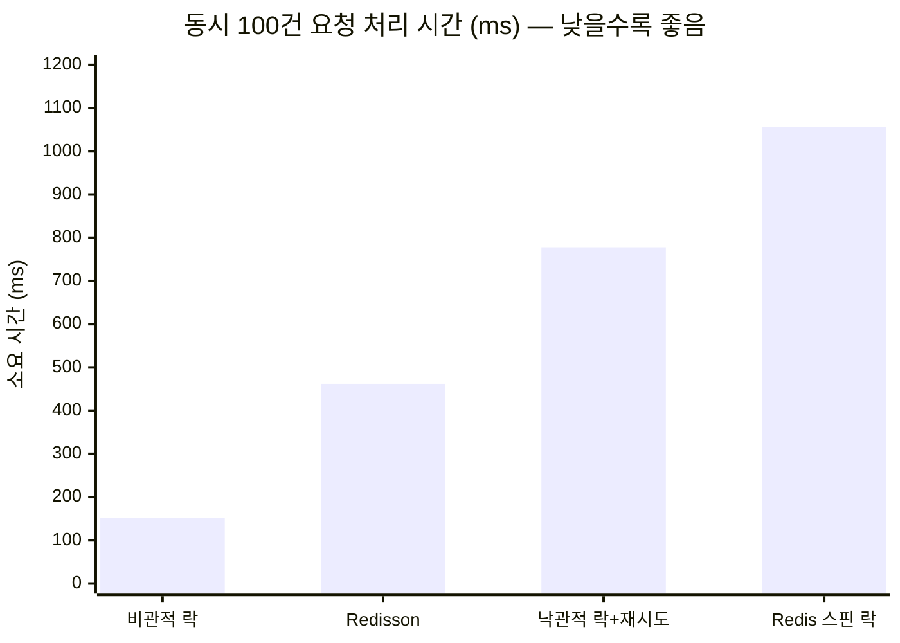
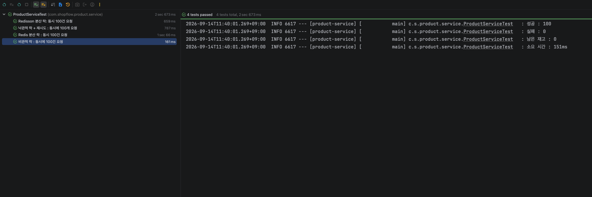
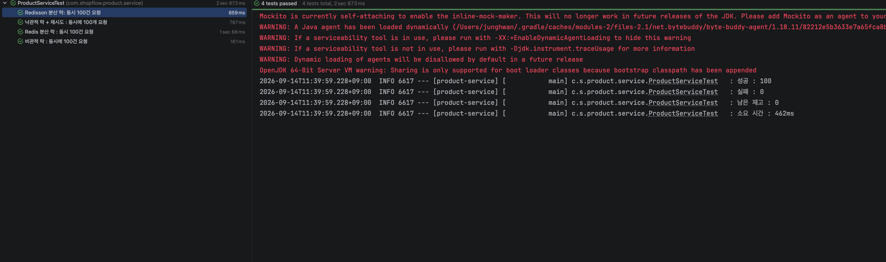
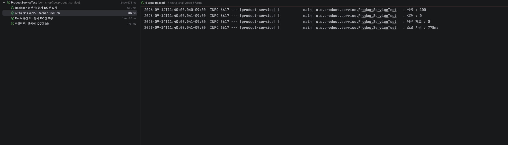
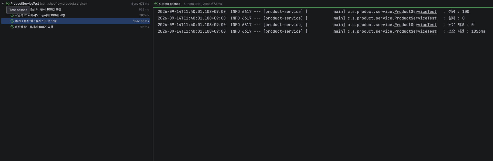
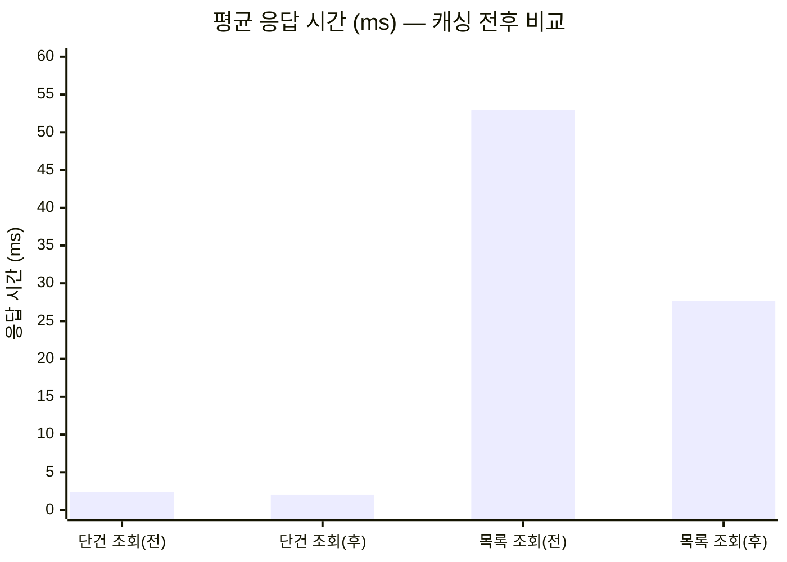
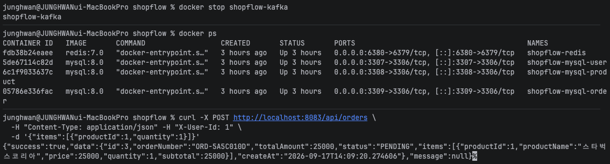
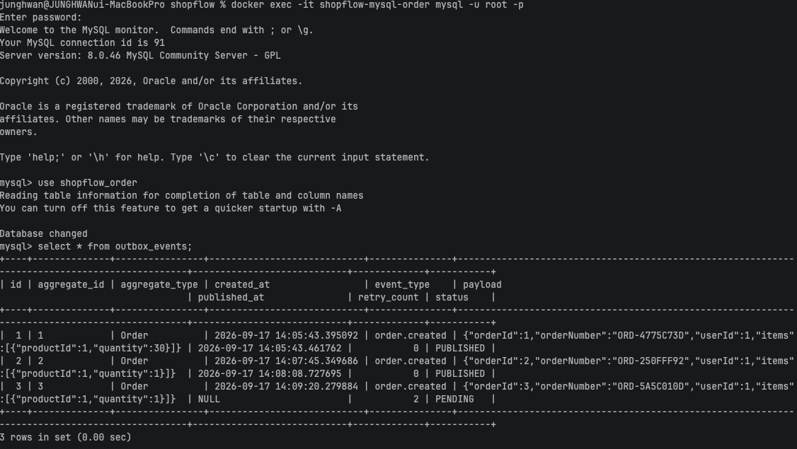
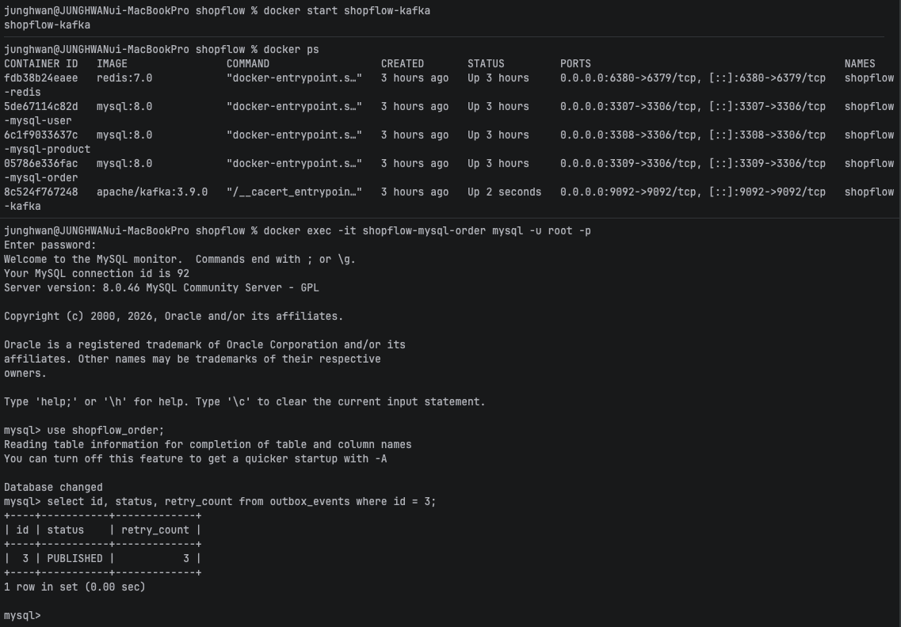

# ShopFlow

> 동시 주문 상황의 재고 정합성과 서비스 간 비동기 통신을 다룬 MSA 기반 이커머스 백엔드

<br/>

## 이 프로젝트에서 다룬 것

| 문제 | 접근 | 결과 |
|---|---|---|
| 동시 주문 시 재고가 맞지 않음 | 4가지 락 전략 구현 후 측정 비교 | 요청 100건 중 11건만 성공 → **100건 전부 성공** |
| 분산 환경에서 트랜잭션을 묶을 수 없음 | Kafka 기반 Saga 패턴 + 보상 트랜잭션 | 재고 부족 시 주문 자동 취소 |
| 목록 조회 응답이 느림 | Redis 캐싱 적용 후 부하 테스트 검증 | 평균 응답 **52.9ms → 27.7ms (48% 단축)** |
| 인증 로직이 서비스마다 중복 | API Gateway에서 JWT 검증 일원화 | 미인증 요청이 서비스에 도달하지 않음 |
| 이벤트 발행과 DB 쓰기의 원자성 부재 | Outbox 패턴으로 이벤트를 DB에 선저장 | Kafka 장애 중 접수된 주문도 **복구 시 자동 발행** |

각 항목의 측정 과정과 판단 근거는 [트러블슈팅](#트러블슈팅)에 정리했습니다.

<br/>

## 목차

- [기술 스택](#기술-스택)
- [시스템 아키텍처](#시스템-아키텍처)
- [실행 방법](#실행-방법)
- [서비스별 구현](#서비스별-구현)
- [트러블슈팅](#트러블슈팅)
    - [1. 동시 주문 시 재고 정합성 문제](#1-동시-주문-시-재고-정합성-문제)
    - [2. 분산 트랜잭션 — Saga 패턴](#2-분산-트랜잭션--saga-패턴)
    - [3. 캐싱은 언제 효과적인가](#3-캐싱은-언제-효과적인가)
    - [4. 이벤트 발행의 원자성 — Dual Write 문제](#4-이벤트-발행의-원자성--dual-write-문제)

<br/>

## 기술 스택

| 구분 | 기술 |
|---|---|
| Language | Java 21 |
| Framework | Spring Boot 4.1.1 |
| Build | Gradle 멀티 모듈 |
| Database | MySQL 8.0 (서비스별 분리) |
| Cache / Lock | Redis 7.0, Redisson 4.7.0 |
| Message Queue | Apache Kafka 3.9 (KRaft) |
| Gateway | Spring Cloud Gateway (WebFlux) |
| Security | Spring Security, JWT |
| Infra | Docker Compose |
| Load Test | K6 |
| Docs | SpringDoc OpenAPI |

<br/>

## 시스템 아키텍처

```
                          Client
                            │
                            ▼
                 ┌────────────────────┐
                 │    API Gateway     │  :8080
                 │  JWT 검증 / 라우팅   │
                 └──────────┬─────────┘
                            │  X-User-Id 헤더 주입
          ┌─────────────────┼─────────────────┐
          ▼                 ▼                 ▼
    ┌───────────┐     ┌───────────┐     ┌───────────┐
    │   User    │     │  Product  │     │   Order   │
    │   :8081   │     │   :8082   │     │   :8083   │
    └─────┬─────┘     └─────┬─────┘     └─────┬─────┘
          │                 │                 │
          ▼                 ▼                 ▼
      ┌───────┐         ┌───────┐         ┌───────┐
      │ MySQL │         │ MySQL │         │ MySQL │
      │ :3307 │         │ :3308 │         │ :3309 │
      └───────┘         └───────┘         └───────┘
          │                 │                 │
          └────────┬────────┘                 │
                   ▼                          │
             ┌──────────┐                     │
             │  Redis   │ :6380               │
             │ 토큰/분산락 │                     │
             └──────────┘                     │
                                              │
                   ┌──────────────────────────┘
                   ▼
            ┌─────────────┐
            │    Kafka    │ :9092
            │  이벤트 버스  │
            └─────────────┘
```

### 서비스 간 통신 방식

| 구간 | 방식 | 선택 이유 |
|---|---|---|
| Client → 각 서비스 | Gateway 경유 (동기) | 인증 일원화, 엔드포인트 단일화 |
| Order → Product (상품 조회) | REST (동기) | 주문 생성의 전제 조건이므로 즉시성 필요 |
| Order ↔ Product (재고 처리) | Kafka (비동기) | 일시적 장애 내성, 주문 응답 지연 방지 |

### 모듈 구조

```
shopflow/
├── gateway/           # 라우팅, JWT 검증
├── user-service/      # 회원, 인증/인가
├── product-service/   # 상품, 재고 제어
├── order-service/     # 주문, Saga 조율
├── common/            # 응답 형식, 예외 체계, 이벤트 DTO
├── load-test/         # K6 부하 테스트 스크립트
└── docker-compose.yml
```

### 설계 원칙

**서비스별 DB 분리** — 각 서비스가 독립된 데이터베이스를 소유합니다. 서비스 간 데이터 참조는 외래키 대신 ID만 저장하고, 정합성은 애플리케이션 레벨에서 보장합니다. 결합도를 낮춘 대신 분산 트랜잭션 문제를 감수했고, 이는 Saga 패턴으로 해결했습니다.

**도메인 모델 패턴** — 재고 차감, 주문 상태 전이 같은 비즈니스 규칙을 엔티티 내부에 캡슐화했습니다. 서비스 레이어에서 `setStatus()` 같은 임의 조작이 불가능하도록 막아, 규칙이 한 곳에서만 관리되도록 했습니다.

**공통 모듈 분리** — API 응답 형식과 예외 체계를 `common` 모듈로 추출해 세 서비스가 동일한 규약을 따르도록 했습니다.

<br/>

## 실행 방법

### 요구 사항

Java 21, Docker

### 인프라 기동

```bash
docker-compose up -d
```

| 컨테이너 | 포트 | 용도 |
|---|---|---|
| mysql-user | 3307 | User Service DB |
| mysql-product | 3308 | Product Service DB |
| mysql-order | 3309 | Order Service DB |
| redis | 6380 | 토큰 저장, 분산 락, 캐시 |
| kafka | 9092 | 이벤트 브로커 |

### 애플리케이션 기동

```bash
./gradlew build

./gradlew :user-service:bootRun
./gradlew :product-service:bootRun
./gradlew :order-service:bootRun
./gradlew :gateway:bootRun
```

### API 문서

- Product: http://localhost:8082/swagger-ui/index.html
- Order: http://localhost:8083/swagger-ui/index.html

<br/>

## 서비스별 구현

### User Service

JWT 기반 인증을 제공합니다.

- BCrypt 단방향 해싱으로 비밀번호 저장
- Access Token(30분) / Refresh Token(7일) 분리 발급
- Refresh Token을 Redis에 TTL과 함께 저장 — 로그아웃 시 삭제해 재발급 차단
- 로그아웃된 Access Token은 블랙리스트에 등록 (TTL = 남은 만료 시간)

| Method | Endpoint | 설명 |
|---|---|---|
| POST | `/api/users/signup` | 회원가입 |
| POST | `/api/users/login` | 로그인 |
| POST | `/api/users/logout` | 로그아웃 |

<details>
<summary>세션이 아닌 JWT를 선택한 이유</summary>

<br/>

세션 방식은 서버가 로그인 상태를 보관하므로, 인스턴스가 여러 대로 확장되면 세션 저장소를 별도로 구성해야 합니다. JWT는 토큰 자체에 인증 정보를 담아 서버가 무상태로 동작하므로 수평 확장에 유리합니다.

다만 JWT는 발급 후 서버가 강제 무효화할 수 없다는 한계가 있습니다. 이를 보완하기 위해 Refresh Token을 Redis에서 관리하고, Access Token은 블랙리스트로 처리해 로그아웃을 실질적으로 동작하게 만들었습니다.

</details>

<br/>

### Product Service

상품 관리와 재고 제어를 담당합니다.

- 재고 차감/증가 로직을 엔티티에 캡슐화 (재고 부족 검증, 품절 상태 자동 전환)
- 4가지 동시성 제어 방식 구현 및 성능 비교 ([상세](#1-동시-주문-시-재고-정합성-문제))
- Redis 캐싱 적용 및 효과 측정 ([상세](#3-캐싱은-언제-효과적인가))

| Method | Endpoint | 설명 |
|---|---|---|
| POST | `/api/products` | 상품 등록 |
| GET | `/api/products/{id}` | 상품 조회 |
| GET | `/api/products?category=` | 카테고리별 조회 |

<br/>

### Order Service

주문 생성과 Saga 조율을 담당합니다.

- 주문 시점의 상품명·가격을 스냅샷으로 저장 — 이후 상품 정보가 변경되어도 과거 주문 내역 보존
- Kafka 이벤트로 재고 차감 요청, 결과에 따라 주문 상태 전이
- `JOIN FETCH`로 N+1 문제 해결

| Method | Endpoint | 설명 |
|---|---|---|
| POST | `/api/orders` | 주문 생성 |
| GET | `/api/orders/{id}` | 주문 상세 |
| GET | `/api/orders` | 내 주문 목록 |

<details>
<summary>User 엔티티와 연관관계를 맺지 않은 이유</summary>

<br/>

`Order`는 `userId`를 `Long` 필드로만 보관하고 `@ManyToOne` 연관관계를 맺지 않았습니다. User Service와 Order Service가 물리적으로 분리된 데이터베이스를 사용하므로 JOIN이 불가능하기 때문입니다.

DB 레벨의 참조 무결성을 포기하는 대신 서비스 독립성을 얻었습니다. 무결성은 Gateway의 JWT 검증을 통과한 `X-User-Id`를 신뢰하는 방식으로 애플리케이션 레벨에서 보장합니다.

</details>

<br/>

---

<br/>

# 트러블슈팅

<br/>

## 1. 동시 주문 시 재고 정합성 문제

### 문제 상황

재고 100개인 상품에 100건의 주문이 동시에 들어오는 상황을 테스트로 재현했습니다.

```java
int threadCount = 100;
ExecutorService executorService = Executors.newFixedThreadPool(32);
CountDownLatch latch = new CountDownLatch(threadCount);

for (int i = 0; i < threadCount; i++) {
    executorService.submit(() -> {
        try {
            productService.decreaseStock(productId, 1);
            successCount.incrementAndGet();
        } catch (Exception e) {
            failCount.incrementAndGet();
        } finally {
            latch.countDown();
        }
    });
}
latch.await();
```

`@Version` 기반 낙관적 락만 적용한 상태의 결과입니다.

```
성공: 11
실패: 89
남은 재고: 89   (기대값: 0)
```

재고가 음수로 떨어지는 것은 막았지만, **89건의 주문이 재고가 남아있음에도 거절**되었습니다.

### 원인 분석

낙관적 락은 충돌을 **감지**할 뿐 **해결**하지 않습니다.

```
100개 스레드가 동시에 version=0 상태를 조회
  → UPDATE ... WHERE id=? AND version=0
  → 1개만 성공 (version=1로 증가)
  → 나머지 99개는 WHERE 조건 불일치로 0 rows affected
  → ObjectOptimisticLockingFailureException 발생
  → 재시도 로직이 없으므로 그대로 실패 처리
```

버전 충돌 후 어떻게 할지는 애플리케이션이 결정해야 하는 영역이었습니다.

### 해결 과정

네 가지 방식을 구현하고 동일 조건에서 측정했습니다.

<details>
<summary><b>1. 낙관적 락 + 재시도</b></summary>

<br/>

```java
@Retryable(
    retryFor = ObjectOptimisticLockingFailureException.class,
    maxAttempts = 100,
    backoff = @Backoff(delay = 50)
)
@Transactional
public void decreaseStockWithRetry(Long productId, int quantity) {
    Product product = productRepository.findById(productId)
            .orElseThrow(() -> new BusinessException(ErrorCode.PRODUCT_NOT_FOUND));
    product.decreaseStock(quantity);
}
```

`@Retryable`을 `@Transactional`보다 바깥에 배치한 것이 핵심입니다. 순서가 반대이면 이미 롤백 표시된 트랜잭션 안에서 재시도하게 되어 계속 실패합니다. 바깥에 두어야 롤백 완료 후 새 트랜잭션으로 재시도됩니다.

</details>

<details>
<summary><b>2. 비관적 락</b></summary>

<br/>

```java
@Lock(LockModeType.PESSIMISTIC_WRITE)
@Query("SELECT p FROM Product p WHERE p.id = :id")
Optional<Product> findByIdWithPessimisticLock(@Param("id") Long id);
```

조회 시점에 `SELECT ... FOR UPDATE`로 행 단위 쓰기 락을 획득합니다. 락을 얻지 못한 트랜잭션은 대기하므로 재시도 없이 순차 처리됩니다.

</details>

<details>
<summary><b>3. Redis 분산 락 (직접 구현)</b></summary>

<br/>

`SETNX`의 원자성을 이용한 스핀 락입니다.

```java
public Boolean lock(Long key) {
    return redisTemplate.opsForValue()
            .setIfAbsent(generateKey(key), "lock", Duration.ofMillis(3_000));
}
```

```java
while (!redisLockRepository.lock(productId)) {
    Thread.sleep(50);
}
try {
    productService.decreaseStockWithRedisLock(productId, quantity);
} finally {
    redisLockRepository.unlock(productId);
}
```

TTL 3초를 설정해 락 보유 중 프로세스가 종료되어도 데드락이 발생하지 않도록 했습니다.

</details>

<details>
<summary><b>4. Redisson 분산 락</b></summary>

<br/>

```java
RLock lock = redissonClient.getLock("lock:product:" + productId);

try {
    boolean acquired = lock.tryLock(10, 3, TimeUnit.SECONDS);
    if (!acquired) {
        throw new BusinessException(ErrorCode.LOCK_ACQUISITION_FAILED);
    }
    productService.decreaseStockWithRedisLock(productId, quantity);
} finally {
    if (lock.isHeldByCurrentThread()) {
        lock.unlock();
    }
}
```

**락 획득/해제와 트랜잭션의 경계를 별도 클래스로 분리**했습니다. 같은 클래스 내부 호출은 Spring AOP 프록시를 거치지 않아 `@Transactional`이 적용되지 않고, 무엇보다 트랜잭션 커밋 전에 락이 해제되면 다음 요청이 갱신 전 데이터를 읽어 동시성 제어가 무력화되기 때문입니다.

락 획득 실패 시 조용히 `return`하지 않고 예외를 던지도록 했습니다. 호출자가 실패를 인지하지 못하면 "주문은 성공했는데 재고는 그대로"인 데이터 불일치가 발생합니다.

</details>

### 측정 결과

재고 100, 동시 요청 100건, 스레드 풀 32 조건에서 측정했습니다.



| 방식 | 성공 | 실패 | 남은 재고 | 소요 시간 |
|---|---|---|---|---|
| 낙관적 락 (재시도 없음) | 11 | 89 | 89 | — |
| **비관적 락** | 100 | 0 | 0 | **151ms** |
| Redisson 분산 락 | 100 | 0 | 0 | 462ms |
| 낙관적 락 + 재시도 | 100 | 0 | 0 | 778ms |
| Redis 스핀 락 (직접 구현) | 100 | 0 | 0 | 1056ms |

<details>
<summary>테스트 실행 결과 스크린샷</summary>

<br/>






</details>

### 분석

**낙관적 락이 느린 이유**는 충돌률에 있습니다. 재고 차감은 단일 레코드에 경쟁이 집중되어 충돌률이 100%에 가깝습니다. 매 시도마다 1개만 성공하고 99개가 롤백되므로, 100건을 처리하는 데 수천 번의 SELECT/UPDATE가 발생합니다. 여기에 재시도 간 대기 시간(50ms)이 누적됩니다.

낙관적 락은 이름 그대로 "충돌이 드물 것"이라는 가정 위에 설계된 방식이며, 이 가정이 깨지는 도메인에서는 부적합합니다.

**직접 구현한 스핀 락과 Redisson의 2배 차이**는 대기 방식에서 발생했습니다.

| | 스핀 락 | Redisson |
|---|---|---|
| 대기 방식 | `Thread.sleep(50)` 반복 폴링 | Redis Pub/Sub 구독 후 블로킹 |
| 락 해제 감지 | 최대 50ms 지연 | 즉시 |
| 대기 중 Redis 부하 | 지속적인 요청 | 없음 |
| 락 자동 연장 | 불가 | watchdog 지원 |

스핀 락은 락이 1ms 만에 해제되어도 이를 알 방법이 없어 50ms를 모두 소모합니다. Redisson은 락 해제 시 Pub/Sub 채널로 통지받아 즉시 깨어나므로 대기 낭비가 없습니다.

### 결론

측정만 보면 비관적 락이 가장 빠르지만, 이 프로젝트에서는 **Redisson 분산 락을 선택**했습니다.

비관적 락은 락 대기 중에도 DB 커넥션을 점유합니다. HikariCP 기본 풀 크기는 10이므로, 동시 요청이 이를 초과하면 재고 경합이 아니라 **커넥션 고갈로 먼저 장애**가 발생합니다. 또한 서비스를 다중 인스턴스로 확장하면 인스턴스 수만큼 DB에 부하가 집중됩니다.

Redisson 분산 락은 DB 접근 이전 단계에서 요청을 직렬화하므로 커넥션 점유 시간을 최소화하고, 여러 인스턴스가 하나의 Redis를 공유하므로 전역 락으로 동작합니다.

> **선택 기준**: 단일 인스턴스 + 예측 가능한 트래픽이라면 비관적 락이 단순하고 빠릅니다. 다중 인스턴스 확장을 전제하는 MSA 구조에서는 Redisson이 적합하다고 판단했습니다.

<br/>

---

<br/>

## 2. 분산 트랜잭션 — Saga 패턴

### 문제 상황

주문 생성은 두 서비스에 걸친 작업입니다.

```
1. Order Service  : 주문 저장
2. Product Service: 재고 차감
```

모놀리식이라면 `@Transactional` 하나로 묶어 재고 부족 시 주문도 함께 롤백됩니다. 그러나 두 서비스는 **물리적으로 분리된 DB**를 사용하므로 단일 트랜잭션으로 묶을 수 없습니다.

Order Service가 이미 커밋한 주문을, Product Service의 실패를 이유로 롤백할 방법이 없습니다.

### 해결 과정

**보상 트랜잭션(Compensating Transaction)** 으로 접근했습니다. 롤백 대신 **역방향 작업을 수행**하는 방식입니다.

```
정방향: 주문 생성 (PENDING)
역방향: 주문 취소 (CANCELLED)
```

중앙에서 전체 서비스를 관리하는 별도의 조정자 없이, 각 서비스가 이벤트를 통해 서로 필요한 정보를 주고받는 Choreography 방식을 사용했습니다. 서비스가 3개로 많지 않아, 별도의 오케스트레이터를 추가하는 것보다 각 서비스가 직접 통신하도록 구성하는 것이 더 단순하고 효율적이라고 판단했습니다.

### 이벤트 흐름

```
[정상 흐름]
Order Service                  Kafka                Product Service
     │                           │                         │
     │ 상품 조회 (REST) ──────────────────────────────────▶│
     │◀───────────────────────────────── 상품 정보 응답 ────│
     │                           │                         │
     │ 주문 저장 (PENDING)        │                         │
     │ order.created 발행 ──────▶│──────────────────────▶ │
     │                           │                         │ 재고 차감
     │ 201 Created 즉시 응답      │                         │
     │                           │◀──── stock.decreased ───│
     │◀──────────────────────────│                         │
     │ 주문 상태 → PAID           │                         │


[보상 흐름 — 재고 부족]
     │ order.created 발행 ──────▶│──────────────────────▶ │
     │                           │                         │ 재고 부족
     │                           │◀──── stock.failed ──────│
     │◀──────────────────────────│                         │
     │ 주문 상태 → CANCELLED      │                         │
```

**실패를 예외가 아닌 이벤트로 발행하였습니다.**

```java
@KafkaListener(topics = KafkaTopic.ORDER_CREATED, groupId = "product-service")
public void handleOrderCreated(OrderCreatedEvent event) {
    try {
        event.items().forEach(item ->
                stockService.decreaseStock(item.productId(), item.quantity())
        );
        publishStockDecreased(event);
    } catch (Exception e) {
        publishStockFailed(event, e.getMessage());
    }
}
```

예외를 그대로 던지면 Kafka가 처리 실패로 판단해 동일 메시지를 계속 재전달합니다. 재고가 실제로 부족한 상황이라면 무한 재시도에 빠집니다. 실패 이벤트를 발행하면 메시지는 정상 처리로 커밋되고, 보상 트랜잭션이 실행됩니다.

### 설계 시 고려한 점

**메시지 키로 순서 보장**

```java
kafkaTemplate.send(topic, String.valueOf(event.orderId()), event);
//                        ↑ 키
```

Kafka는 키를 해싱해 파티션을 결정합니다. 동일 주문의 이벤트는 항상 같은 파티션으로 전달되므로, 파티션 내 순서 보장 특성에 의해 이벤트 역전이 발생하지 않습니다.

**취소를 삭제가 아닌 상태 전이로**

주문 레코드를 삭제하지 않고 `CANCELLED` 상태로 남깁니다. 사용자가 주문 실패 사유를 확인할 수 있고, 재고 부족으로 인한 이탈률 분석도 가능합니다.

### 설계상 고려사항

주문 처리와 재고 차감이 바로 동시에 이루어지는 것은 아니기 때문에, 잠시 동안 주문은 완료됐지만 재고가 아직 차감되지 않은 상태가 발생할 수 있습니다.

대신 각 서비스를 독립적으로 처리하도록 구성해 빠른 응답과 장애 대응이 가능하도록 했습니다. Product Service에 문제가 생기더라도 주문은 정상적으로 접수되고, 이벤트는 Kafka에 저장되어 서비스가 복구된 후 재고 차감이 처리됩니다.

<br/>

---

<br/>

## 3. 캐싱은 언제 효과적인가

### 문제 인식

상품 조회는 가장 호출 빈도가 높은 API입니다. Redis 캐싱을 적용하기로 했으나, **적용 전후를 측정하지 않으면 효과를 알 수 없다**고 판단해 K6로 기준 수치부터 확보했습니다.

### 검증 설계

두 가지 시나리오를 나누어 측정했습니다.

| 시나리오 | 쿼리 특성 | 응답 크기 |
|---|---|---|
| 단건 조회 | PK 인덱스 조회, 1건 | 약 1KB |
| 목록 조회 | 카테고리 조건, 약 1000건 | 약 570KB |

동일한 부하 조건(VU 20, 50초)에서 `@Cacheable`만 켜고 끄며 측정했습니다.

```javascript
export const options = {
    stages: [
        { duration: '10s', target: 20 },   // 워밍업 (JIT 컴파일 안정화)
        { duration: '30s', target: 20 },   // 측정 구간
        { duration: '10s', target: 0 },
    ],
};
```

부하를 서서히 올린 것은 JVM의 JIT 컴파일 특성 때문입니다. 초기 실행 시 인터프리터 모드로 동작하다가 점진적으로 최적화되므로, 즉시 최대 부하를 가하면 워밍업 구간이 측정값을 왜곡합니다.

### 측정 결과



**단건 조회 (PK 1건)**

| 지표 | 캐싱 전 | 캐싱 후 | 변화 |
|---|---|---|---|
| TPS | 1,233 | 1,260 | +2.2% |
| 평균 응답 | 2.39ms | 2.05ms | -14% |
| p(95) | 4.30ms | 3.92ms | -8.8% |

**목록 조회 (약 1000건)**

| 지표 | 캐싱 전 | 캐싱 후 | 변화 |
|---|---|---|---|
| TPS | 254 | 425 | **+67%** |
| 평균 응답 | 52.92ms | 27.65ms | **-48%** |
| p(95) | 78.06ms | 47.33ms | **-39%** |

### 분석

**단건 조회에서 효과가 미미했던 이유**는 MySQL이 이미 캐싱하고 있었기 때문입니다.

InnoDB 버퍼 풀은 자주 접근하는 데이터 페이지를 메모리에 유지합니다. PK 인덱스로 1건을 조회하는 작업은 사실상 메모리 읽기이므로, Redis를 얹어도 "메모리 → 메모리"에 불과합니다. 오히려 Redis 왕복이라는 네트워크 비용이 추가됩니다.

**목록 조회에서 효과가 컸던 이유**는 캐싱으로 제거되는 작업의 비중이 크기 때문입니다.

```
캐싱 전 (52.9ms)
├─ DB 조회 (전체 스캔 5000건 → 1000건 반환)   ─┐
├─ 엔티티 → DTO 매핑 1000회                    ├─ 캐싱으로 제거되는 구간
├─ JSON 직렬화 (570KB)                        ─┘
└─ 네트워크 전송                                ─── 캐싱해도 유지

캐싱 후 (27.7ms)
├─ Redis 조회
└─ 네트워크 전송
```

캐싱 후에도 27.7ms가 남는 이유는 **570KB를 전송하는 비용은 캐싱으로 줄일 수 없기** 때문입니다.

### 결론

> **캐싱은 "조회 결과를 만들어내는 비용"이 클 때 효과적입니다.** 단순 PK 조회처럼 DB 자체가 이미 최적화한 영역에서는 이득이 제한적이며, 네트워크 왕복 비용만 추가될 수 있습니다.

이 프로젝트에서는 단건 조회에도 캐싱을 유지했습니다. 응답 시간 이득은 작지만 **DB 부하를 줄이는 효과**는 유효하며, 트래픽이 증가하면 커넥션 풀 여유 확보에 기여하기 때문입니다.

### 캐시 무효화

재고 변동 시 캐시를 갱신하도록 처리했습니다.

```java
@Caching(evict = {
        @CacheEvict(value = CacheConfig.PRODUCT_CACHE, key = "#productId"),
        @CacheEvict(value = CacheConfig.PRODUCT_LIST_CACHE, allEntries = true)
})
@Transactional
public void decreaseStockWithRedisLock(Long productId, int quantity) { ... }
```

목록 캐시는 `allEntries = true`로 전체를 비웁니다. 변경된 상품이 어느 카테고리 캐시에 포함되어 있는지 추적하는 비용보다, 전체 무효화 후 재생성하는 편이 단순하고 안전하다고 판단했습니다. TTL 10분을 함께 설정해 무효화 누락 시에도 데이터가 무한정 낡지 않도록 했습니다.

### 부수적으로 확인한 것

측정 과정에서 K6가 `can't assign requested address` 오류를 반복했습니다. 캐싱 적용으로 응답이 빨라지자 초당 17,000건 이상 요청이 발생했고, macOS의 기본 ephemeral 포트 범위(49152–65535, 약 16,000개)와 TIME_WAIT 유지 시간(15초)으로 인해 **포트가 고갈된 것**이 원인이었습니다.

```bash
sudo sysctl -w net.inet.tcp.msl=1000          # TIME_WAIT 15s → 1s
sudo sysctl -w net.inet.ip.portrange.first=16384   # 포트 범위 3배 확장
```

서버 성능이 개선되자 테스트 클라이언트가 먼저 한계에 도달한 사례로, 부하 테스트 시 측정 도구 자체의 병목을 확인해야 한다는 점을 배웠습니다.

<br/>

---

<br/>

## 4. 이벤트 발행의 원자성 — Dual Write 문제

### 문제 상황

Saga 패턴을 적용한 뒤에도 주문 생성 로직에는 구조적 결함이 남아 있었습니다.

```java
@Transactional
public OrderResponse createOrder(Long userId, OrderCreateRequest request) {
    Order saved = orderRepository.save(order);                  // ① MySQL 쓰기
    orderEventProducer.publishOrderCreated(toEvent(saved));     // ② Kafka 쓰기
    return OrderResponse.from(saved);
}   // ③ 트랜잭션 커밋
```

**서로 다른 두 시스템에 쓰기를 수행**하고 있으나, 이 둘을 하나의 트랜잭션으로 묶을 수단이 없습니다. 이를 Dual Write 문제라고 합니다.

시간 순서로 보면 다음과 같은 위험이 존재했습니다.

```
① save()  → INSERT 준비 (아직 커밋 전, 다른 트랜잭션에서 조회 불가)
② 이벤트 발행 → Kafka로 즉시 전송, Product Service가 재고 차감 시작
③ 커밋
```

**발생 가능한 두 가지 장애 시나리오**

| 시나리오 | 결과 |
|---|---|
| ③ 직전 예외 발생 → 롤백 | 주문은 존재하지 않는데 재고만 차감됨 |
| 재고 차감이 ③보다 먼저 완료 | `stock.decreased` 수신 시점에 주문이 미커밋 상태여서 조회 실패 |

두 번째는 로컬 환경에서 거의 재현되지 않다가 부하 상황에서 간헐적으로 발생하는 유형이라 더 위험했습니다.

<br/>

### 1차 해결 — `@TransactionalEventListener`

이벤트 발행 시점을 **트랜잭션 커밋 이후로 미루는** 방식으로 접근했습니다.

Spring 내부 이벤트를 중간 단계로 두고, 커밋 완료 후에만 Kafka로 발행되도록 구성했습니다.

```java
// OrderService — Kafka로 직접 발행하지 않고 내부 이벤트만 등록
@Transactional
public OrderResponse createOrder(Long userId, OrderCreateRequest request) {
    Order saved = orderRepository.save(order);
    eventPublisher.publishEvent(new OrderCreatedInternalEvent(toEvent(saved)));
    return OrderResponse.from(saved);
}
```

```java
// 커밋 완료 후에만 실행
@TransactionalEventListener(phase = TransactionPhase.AFTER_COMMIT)
public void handleOrderCreated(OrderCreatedInternalEvent event) {
    orderEventProducer.publishOrderCreated(event.payload());
}
```

`AFTER_COMMIT`을 지정하면 트랜잭션이 롤백될 경우 리스너가 **아예 실행되지 않습니다.** 이로써 두 시나리오가 모두 해소되었습니다.

- 롤백 시 → 이벤트 미발행 → 재고 차감도 발생하지 않음
- 커밋 완료 후 발행 → `stock.decreased` 수신 시 주문 조회 성공

<br/>

### 1차 해결의 한계

순서 문제는 해결했지만, **발행 실패에 대한 대응 수단이 없었습니다.**

```java
@TransactionalEventListener(phase = AFTER_COMMIT)
public void handleOrderCreated(OrderCreatedInternalEvent event) {
    orderEventProducer.publishOrderCreated(event.payload());
    //  ↑ 이 시점에 Kafka가 다운되어 있다면?
}
```

```
주문 저장 커밋 성공 (DB에 PENDING 상태로 존재)
Kafka 발행 실패 (브로커 다운)
→ 에러 로그만 남고 종료
→ Kafka가 복구되어도 재발행 수단 없음
→ 해당 주문은 영구히 PENDING 상태
```

커밋과 발행 사이의 원자성은 여전히 보장되지 않았습니다.

<br/>

### 2차 해결 — Outbox 패턴

**"같은 DB 안이라면 트랜잭션으로 묶을 수 있다"** 는 점을 활용했습니다.

이벤트를 Kafka로 직접 보내는 대신, **주문과 동일한 DB의 outbox 테이블에 먼저 저장**하고 별도 프로세스가 이를 읽어 발행하도록 분리했습니다.

```
[기존]
주문 저장 (MySQL) ─── (트랜잭션 안)
이벤트 발행 (Kafka) ─── (트랜잭션 밖) 

[Outbox]
주문 저장 (MySQL)         ─┐
이벤트 저장 (MySQL outbox) ─┴─ (동일 트랜잭션)
                               │
                         (스케줄러가 별도 처리)
                               ▼
                       outbox 조회 → Kafka 발행
```

**이벤트 저장 — 주문과 같은 트랜잭션 내에서**

```java
@Transactional
public OrderResponse createOrder(Long userId, OrderCreateRequest request) {
    Order saved = orderRepository.save(order);
    saveOutboxEvent(saved);          // 같은 트랜잭션
    return OrderResponse.from(saved);
}   // ← 둘 다 커밋되거나 둘 다 롤백
```

**발행 — 독립된 스케줄러**

```java
@Scheduled(fixedDelay = 1000)
@Transactional
public void publishPendingEvents() {
    List<OutboxEvent> pendingEvents = outboxEventRepository
            .findByStatusOrderByIdAsc(OutboxEvent.Status.PENDING, Limit.of(BATCH_SIZE));

    for (OutboxEvent event : pendingEvents) {
        try {
            kafkaTemplate.send(
                    event.getEventType(),
                    event.getAggregateId(),
                    event.getPayload()
            ).get();                    // 발행 완료까지 대기
            event.markAsPublished();
        } catch (Exception e) {
            event.markAsFailed();       // retryCount 증가, 다음 주기에 재시도
        }
    }
}
```

<details>
<summary>구현 시 고려한 점</summary>

<br/>

**`.get()`으로 동기 대기** — `send()`는 비동기이므로 결과를 확인하지 않으면 발행 실패한 이벤트를 `PUBLISHED`로 잘못 표시하게 됩니다. 재시도 기회를 잃지 않기 위해 완료를 대기한 뒤 상태를 전이시켰습니다.

**`fixedDelay` 사용** — `fixedRate`는 이전 실행 완료 여부와 무관하게 주기적으로 실행되므로, 발행이 지연되면 여러 스케줄러가 동시에 같은 이벤트를 조회해 중복 발행할 수 있습니다. 이전 실행 종료를 기준으로 하는 `fixedDelay`를 선택했습니다.

**배치 크기 제한** — PENDING 이벤트가 대량 누적된 상황에서 전체를 조회하면 메모리 부담이 큽니다. `Limit`으로 100건씩 나누어 처리하고, `ORDER BY id ASC`로 등록 순서를 보장했습니다.

**재시도 한계** — 브로커 장애가 장기화되면 무의미한 재시도가 반복됩니다. `retryCount`가 임계치를 넘으면 `FAILED`로 전이시켜 운영자 개입이 필요한 상태를 구분했습니다.

**발행 완료 이벤트 정리** — outbox 테이블이 무한히 증가하지 않도록, 매일 새벽 3시에 7일 경과한 `PUBLISHED` 레코드를 삭제하는 스케줄러를 추가했습니다.

</details>

<br/>

### 검증 — Kafka 장애 복구 시나리오

Outbox의 실효성을 확인하기 위해 브로커를 의도적으로 중단한 상태에서 주문을 생성했습니다.

**① Kafka 중단 후 주문 생성**

```bash
docker stop shopflow-kafka
```

브로커가 다운된 상태에서도 주문 API는 정상적으로 `201`을 반환했습니다.



**② outbox 상태 확인**

이벤트가 `PENDING` 상태로 DB에 보존되며 재시도가 누적되고 있었습니다.



```
| id | status  | retry_count |
|  3 | PENDING |           2 |
```

**③ Kafka 복구**

```bash
docker start shopflow-kafka
```

별도 조치 없이 다음 스케줄러 실행 주기에 자동으로 발행되었습니다.



```
| id | status    | retry_count |
|  3 | PUBLISHED |           3 |
```

<br/>

### 결론

| | 직접 발행 | `@TransactionalEventListener` | Outbox 패턴 |
|---|---|---|---|
| 커밋 전 발행 방지 | ❌ | 🅾️ | 🅾️ |
| 롤백 시 이벤트 차단 | ❌ | 🅾️ | 🅾️ |
| 발행 실패 시 복구 | ❌ | ❌ | 🅾️ |
| 추가 비용 | — | 없음 | 테이블 + 스케줄러 |

`@TransactionalEventListener`는 추가 비용 없이 순서 문제를 해결하므로, **브로커 가용성이 충분히 높고 이벤트 유실을 감수할 수 있는 경우**에는 합리적인 선택입니다.

이 프로젝트는 재고 차감이라는 **유실 시 데이터 정합성이 깨지는 작업**을 이벤트로 처리하므로, 테이블과 스케줄러라는 추가 비용을 감수하고 Outbox 패턴을 채택했습니다.

> **트레이드오프**: Outbox는 스케줄러 주기만큼의 발행 지연(최대 1초)이 발생합니다. 실시간성이 더 중요한 도메인이라면 Debezium 등을 이용한 CDC 방식으로 binlog를 직접 구독해 지연과 폴링 부하를 모두 제거할 수 있습니다.

<br/>

### 과정에서 마주친 문제 — 이중 직렬화

Outbox 도입 과정에서 Consumer가 메시지를 역직렬화하지 못하는 문제가 발생했습니다.

```
Cannot construct instance of `OrderCreatedEvent` from String value
```

Kafka에 적재된 메시지를 확인한 결과, JSON 문자열이 한 번 더 감싸져 있었습니다.

```
"{\"orderId\":10,\"orderNumber\":\"ORD-97EFBEA3\",...}"
↑ 바깥 따옴표 + 내부 이스케이프
```

Outbox는 payload를 이미 JSON 문자열로 직렬화해 저장하는데, Producer 설정이 `JsonSerializer`로 남아 있어 **문자열 전체를 다시 JSON으로 변환**한 것이 원인이었습니다.

```yaml
# 직렬화를 애플리케이션이 담당하므로 Kafka는 문자열을 그대로 전달
producer:
  value-serializer: org.apache.kafka.common.serialization.StringSerializer
consumer:
  value-deserializer: org.apache.kafka.common.serialization.StringDeserializer
```

직렬화 책임이 애플리케이션과 Kafka 클라이언트 양쪽에 중복되어 있던 것이 문제였고, **어느 계층이 직렬화를 담당할지 명확히 정하는 것**이 중요하다는 점을 확인했습니다.

또한 설정 변경 이전에 발행된 메시지는 형식이 달라 계속 실패했습니다. Consumer가 동일 메시지를 반복 재시도하다 한계에 도달해 스킵하는 동작을 확인했으며, 이런 처리 불가 메시지를 별도로 격리하는 DLQ(Dead Letter Queue) 구성이 필요하다는 점을 인지했습니다.
