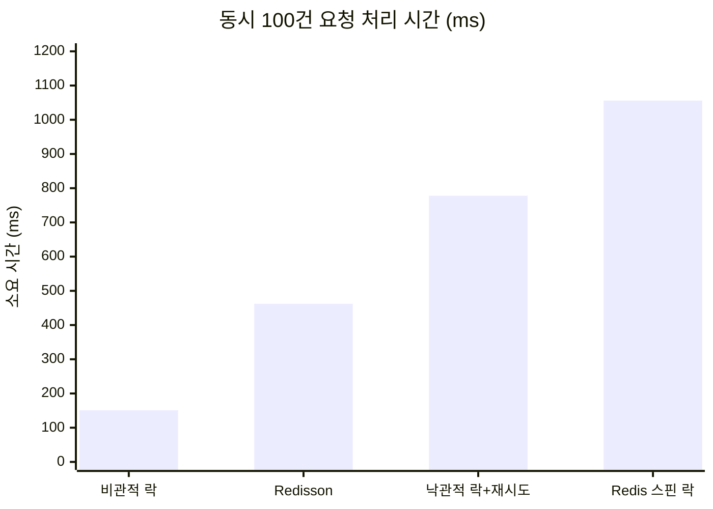

# ShopFlow

MSA 기반 이커머스 주문/재고 시스템

동시 주문 상황에서의 재고 정합성 보장과 서비스 간 비동기 통신을 중심으로 설계한 백엔드 프로젝트입니다.

<br/>

## 목차

- [기술 스택](#기술-스택)
- [시스템 아키텍처](#시스템-아키텍처)
- [실행 방법](#실행-방법)
- [서비스별 구현](#서비스별-구현)
- [트러블슈팅](#트러블슈팅)
- [API 문서](#api-문서)

<br/>

## 기술 스택

| 구분 | 기술 |
|---|---|
| Language | Java 21 |
| Framework | Spring Boot 4.1.1 |
| Build | Gradle (멀티 모듈) |
| Database | MySQL 8.0 (서비스별 분리) |
| Cache / Lock | Redis 7.0, Redisson 4.7.0 |
| ORM | Spring Data JPA |
| Security | Spring Security, JWT (jjwt) |
| Infra | Docker Compose |
| Docs | Swagger (SpringDoc OpenAPI) |
| Test | JUnit 5, AssertJ |

<br/>

## 시스템 아키텍처

```
                      Client
                        │
                        ▼
               ┌─────────────────┐
               │   API Gateway   │  :8080
               └────────┬────────┘
                        │
        ┌───────────────┼───────────────┐
        ▼               ▼               ▼
  ┌───────────┐   ┌───────────┐   ┌───────────┐
  │   User    │   │  Product  │   │   Order   │
  │  Service  │   │  Service  │   │  Service  │
  │   :8081   │   │   :8082   │   │   :8083   │
  └─────┬─────┘   └─────┬─────┘   └─────┬─────┘
        │               │               │
        ▼               ▼               ▼
   ┌─────────┐    ┌─────────┐     ┌─────────┐
   │  MySQL  │    │  MySQL  │     │  MySQL  │
   │  :3307  │    │  :3308  │     │  :3309  │
   └─────────┘    └─────────┘     └─────────┘
        │               │
        └───────┬───────┘
                ▼
          ┌──────────┐
          │  Redis   │  :6380
          └──────────┘
```

### 모듈 구조

```
shopflow/
├── gateway/           # API Gateway (라우팅, JWT 검증)
├── user-service/      # 회원 관리, 인증/인가
├── product-service/   # 상품 관리, 재고 제어
├── order-service/     # 주문 처리
├── common/            # 공통 응답 형식, 예외 처리
└── docker-compose.yml # 로컬 인프라 구성
```

### 설계 원칙

- **DB 분리**: 서비스별로 독립적인 데이터베이스를 사용해 결합도를 낮춤
- **공통 모듈**: 응답 형식(`ApiResponse`)과 예외 체계(`BusinessException`, `ErrorCode`)를 `common` 모듈로 분리
- **도메인 모델 패턴**: 비즈니스 규칙(재고 차감, 상태 전이)을 엔티티 내부에 캡슐화

<br/>

## 실행 방법

### 요구 사항

- Java 21
- Docker, Docker Compose

### 인프라 실행

```bash
docker-compose up -d
```

| 컨테이너 | 호스트 포트 | 용도 |
|---|---|---|
| shopflow-mysql-user | 3307 | User Service DB |
| shopflow-mysql-product | 3308 | Product Service DB |
| shopflow-redis | 6380 | 토큰 저장, 분산 락 |

> 로컬에 설치된 MySQL(3306), Redis(6379)와 포트 충돌을 피하기 위해 다른 포트를 사용합니다.

### 애플리케이션 실행

```bash
./gradlew build
./gradlew :user-service:bootRun
./gradlew :product-service:bootRun
```

<br/>

## 서비스별 구현

### User Service

회원가입, 로그인, 로그아웃을 담당하며 JWT 기반 인증을 제공합니다.

**주요 구현**

- BCrypt를 이용한 비밀번호 단방향 해싱
- Access Token(30분) / Refresh Token(7일) 분리 발급
- Refresh Token을 Redis에 TTL과 함께 저장해 로그아웃 시 즉시 무효화
- 로그아웃된 Access Token은 블랙리스트로 관리 (TTL = 남은 만료 시간)
- `OncePerRequestFilter` 기반 JWT 필터로 SecurityContext 인증 정보 주입

**API**

| Method | Endpoint | 설명 |
|---|---|---|
| POST | `/api/users/signup` | 회원가입 |
| POST | `/api/users/login` | 로그인 (토큰 발급) |
| POST | `/api/users/logout` | 로그아웃 (토큰 무효화) |

<details>
<summary>JWT를 선택한 이유</summary>

<br/>

세션 방식은 서버가 상태를 보관하기 때문에, 서비스가 여러 인스턴스로 확장되면 세션 공유를 위한 별도 저장소가 필요합니다. JWT는 토큰 자체에 인증 정보를 담아 서버가 무상태(stateless)로 동작할 수 있어 MSA 구조에 적합합니다.

다만 JWT는 발급 후 서버가 강제로 무효화할 수 없다는 한계가 있습니다. 이를 보완하기 위해 Refresh Token을 Redis에 저장하고, 로그아웃 시 삭제하는 방식으로 재발급을 차단했습니다. Access Token은 블랙리스트에 등록해 만료 전까지 사용을 막습니다.

</details>

<br/>

### Product Service

상품 CRUD와 재고 관리를 담당하며, 동시 주문 상황에서의 재고 정합성을 보장합니다.

**주요 구현**

- 도메인 모델 패턴으로 재고 차감/증가 로직을 엔티티에 캡슐화
- 낙관적 락, 비관적 락, Redis 분산 락(직접 구현), Redisson 분산 락 4가지 방식 구현 및 성능 비교
- JPA Auditing으로 생성/수정 시각 자동 관리

**API**

| Method | Endpoint | 설명 |
|---|---|---|
| POST | `/api/products` | 상품 등록 |
| GET | `/api/products/{id}` | 상품 단건 조회 |
| GET | `/api/products?category=` | 카테고리별 조회 |

<br/>

## 트러블슈팅

### 동시 주문 시 재고 정합성 문제

#### 문제 상황

재고 100개인 상품에 100건의 주문이 동시에 들어오는 상황을 테스트로 재현했습니다.

```java
int threadCount = 100;
ExecutorService executorService = Executors.newFixedThreadPool(32);
CountDownLatch latch = new CountDownLatch(threadCount);

for (int i = 0; i < threadCount; i++) {
    executorService.submit(() -> {
        try {
            productService.decreaseStock(productId, 1);
            successCount.incrementAndGet();
        } catch (Exception e) {
            failCount.incrementAndGet();
        } finally {
            latch.countDown();
        }
    });
}
latch.await();
```

`@Version`만 적용한 낙관적 락 상태에서는 다음과 같은 결과가 나왔습니다.

```
성공: 11
실패: 89
남은 재고: 89   ← 기대값 0
```

재고가 음수로 떨어지는 것은 막았지만, 89건의 주문이 아무런 후속 처리 없이 실패했습니다. 실제 서비스라면 **재고가 남아있는데도 주문이 거절되는** 상황입니다.

#### 원인 분석

낙관적 락은 충돌을 **감지**할 뿐 **해결**하지는 않습니다.

```
100개 스레드가 동시에 version=0 조회
  → 1개만 UPDATE 성공 (version=1)
  → 나머지 99개는 version 불일치로 OptimisticLockException
  → 재시도 로직이 없으므로 그대로 실패 처리
```

#### 해결 과정

네 가지 방식을 각각 구현하고 동일 조건에서 측정했습니다.

**1. 낙관적 락 + 재시도**

```java
@Retryable(
    retryFor = ObjectOptimisticLockingFailureException.class,
    maxAttempts = 100,
    backoff = @Backoff(delay = 50)
)
@Transactional
public void decreaseStockWithRetry(Long productId, int quantity) { ... }
```

`@Retryable`을 `@Transactional`보다 바깥에 배치해, 롤백 후 새로운 트랜잭션으로 재시도되도록 구성했습니다. 순서가 반대면 이미 실패한 트랜잭션 안에서 재시도해 계속 실패합니다.

**2. 비관적 락**

```java
@Lock(LockModeType.PESSIMISTIC_WRITE)
@Query("SELECT p FROM Product p WHERE p.id = :id")
Optional<Product> findByIdWithPessimisticLock(@Param("id") Long id);
```

조회 시점에 DB 수준의 쓰기 락(`SELECT ... FOR UPDATE`)을 획득해 순차 처리합니다.

**3. Redis 분산 락 (직접 구현)**

`SETNX`의 원자성을 이용해 락을 구현하고, 획득 실패 시 일정 시간 대기 후 재시도하는 스핀 락 방식입니다.

```java
while (!redisLockRepository.lock(productId)) {
    Thread.sleep(50);
}
try {
    productService.decreaseStockWithRedisLock(productId, quantity);
} finally {
    redisLockRepository.unlock(productId);
}
```

**4. Redisson 분산 락**

```java
RLock lock = redissonClient.getLock("lock:product:" + productId);
boolean acquired = lock.tryLock(10, 3, TimeUnit.SECONDS);

if (!acquired) {
    throw new BusinessException(ErrorCode.LOCK_ACQUISITION_FAILED);
}
```

락 획득과 트랜잭션의 경계를 분리해, **트랜잭션 커밋 이후에 락이 해제**되도록 서비스 계층을 나눴습니다. 커밋 전에 락을 풀면 다음 요청이 갱신되지 않은 데이터를 읽어 동시성 제어가 무력화되기 때문입니다.

#### 측정 결과

동일 조건(재고 100, 동시 요청 100건, 스레드 풀 32)에서 측정했습니다.



| 방식 | 성공 | 실패 | 남은 재고 | 소요 시간 |
|---|---|---|---|---|
| 낙관적 락 (재시도 없음) | 11 | 89 | 89 | - |
| **비관적 락** | 100 | 0 | 0 | **151ms** |
| Redisson 분산 락 | 100 | 0 | 0 | 462ms |
| 낙관적 락 + 재시도 | 100 | 0 | 0 | 778ms |
| Redis 스핀 락 (직접 구현) | 100 | 0 | 0 | 1056ms |

재시도를 적용한 이후 네 방식 모두 재고 정합성(남은 재고 0)을 보장했으며, 처리 속도에서 차이가 나타났습니다.

<details>
<summary>테스트 실행 결과 상세 보기</summary>

<br/>

**비관적 락 — 151ms**


**Redisson 분산 락 — 462ms**


**낙관적 락 + 재시도 — 778ms**


**Redis 스핀 락 — 1056ms**


</details>

#### 결론

로컬 단일 인스턴스 환경에서는 비관적 락이 151ms로 가장 빨랐습니다. 재고 차감처럼 **하나의 레코드에 경쟁이 집중되는** 작업은 충돌률이 100%에 가깝기 때문에, 재시도 비용이 누적되는 낙관적 락보다 순차 대기하는 비관적 락이 효율적입니다.

**직접 구현한 스핀 락(1056ms)과 Redisson(462ms)의 2배 이상 차이**는 대기 방식에서 발생했습니다.

| | 스핀 락 (직접 구현) | Redisson |
|---|---|---|
| 대기 방식 | `Thread.sleep(50)` 반복 폴링 | Redis Pub/Sub 구독 후 대기 |
| 락 해제 감지 | 최대 50ms 지연 | 즉시 |
| 대기 중 Redis 부하 | 지속적인 요청 발생 | 요청 없음 |
| 락 자동 연장 | 불가 | 지원 (watchdog) |

스핀 락은 락이 수 ms 만에 해제되어도 이를 감지하지 못하고 50ms를 모두 소모합니다. Redisson은 락 해제 시 Pub/Sub으로 통지받아 즉시 깨어나므로, 같은 분산 락 방식임에도 성능 차이가 크게 벌어졌습니다.

다만 측정 결과만으로 비관적 락을 선택하지는 않았습니다.

- **비관적 락**은 락 대기 중에도 DB 커넥션을 점유합니다. HikariCP 기본 풀 크기(10)를 넘는 동시 요청에서는 커넥션 고갈로 타임아웃이 발생합니다.
- 서비스를 다중 인스턴스로 확장하면 인스턴스 수만큼 DB에 부하가 집중됩니다.
- **Redisson 분산 락**은 DB 접근 전 단계에서 요청을 차단해 커넥션 점유 시간을 줄이고, 여러 인스턴스가 하나의 Redis를 공유하므로 전역 락으로 동작합니다.

> **선택**: MSA 구조에서 다중 인스턴스 확장을 전제로 하므로 **Redisson 분산 락**을 채택했습니다. 단일 인스턴스 + 낮은 트래픽 환경이었다면 비관적 락이 더 나은 선택입니다.

<br/>

---

<!--
다음 작업이 끝나면 아래 형식으로 추가합니다.

[서비스별 구현 섹션에 추가]

### Order Service

주문 생성과 주문 내역 조회를 담당합니다.

**주요 구현**
- ...

**API**
| Method | Endpoint | 설명 |
|---|---|---|


[트러블슈팅 섹션에 추가]

### [문제 제목]

#### 문제 상황
무엇이 어떻게 잘못되었는지 — 재현 코드와 실제 출력을 함께

#### 원인 분석
왜 그런 일이 벌어졌는지 — 동작 원리 수준까지

#### 해결 과정
시도한 방법들과 각각의 코드

#### 측정 결과
Before / After 수치 표 + Mermaid 차트 + 스크린샷

#### 결론
무엇을 선택했고 왜 그렇게 판단했는지 — 트레이드오프 명시
-->

## API 문서

각 서비스 실행 후 아래 경로에서 확인할 수 있습니다.

- User Service: http://localhost:8081/swagger-ui/index.html
- Product Service: http://localhost:8082/swagger-ui/index.html